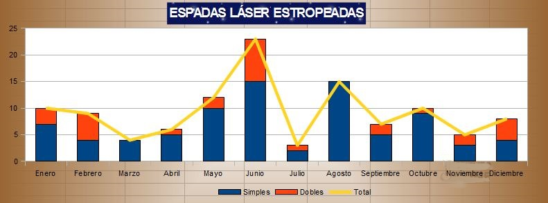

# Segundo Examen Calc - Academia Jedi

## Duración

50 minutos.

## Fecha

Miércoles 2 de Diciembre de 2020.

## Sobre el formato 	

Puede utilizarse la **letra, efectos y colores que se desee**. No hace falta que el resultado visual sea idéntico al propuesto en el examen.
  	 
## Enunciado

La academia de artes Jedi del maestro Yoda pretende realizar un estudio para analizar los desperfectos causados en las espadas láser. Los datos del año pasado arrojan un balance negativo y Yoda va a crear un manual interactivo de uso de la espada láser para evitar que los alumnos aprendices estropeen sus espadas.

## 0 Crear nueva hoja

- Descarga la imagen del maestro Yoda [aquí](http://www.tuinstitutoonline.com/cursos/calcmedio1_v1506/material_alumno/img/ex02yoda.jpg).
- Crea una nueva hoja de cálculo y sálvala con el nombre `apellido1_apellido2_nombre_exacademia.ods`.
- **Efectos y colores son apróximados**.
- **Negritas y alineamientos son exactos**.

## 1 Formato e introducción de datos (1 punto)

- Renombra `Hoja1` como `PrimeraHoja`.
- Crea un rótulo con autoformas o cuadro con el texto `Academia Maestro Yoda`.
- Inserta la imagen descargada del maestro Yoda. Ponle un marco del color que quieras.
- Introduce los datos en la hoja tal y como se muestran a continuación.
- **IMPORTANTE**: Prestad atención a negritas y alineamientos.

## 2 Fórmulas (1 puntos)

### Total

- Calcula la columna de total. `Total = Simples + Dobles`
- Rellena el resto de la columna utilizando la **función autocompletar**.

### % Simples

- Calcula la columna del porcentaje de simples. `% Simples = Simples / Total`
- Rellena el resto de la columna utilizando la **función autocompletar**.
- Pon formato **Porcentaje con 2 decimales**.

### % Dobles

- Calcula la columna del porcentaje de dobles. `% Dobles = Dobles / Total`
- Rellena el resto de la columna utilizando la **función autocompletar**.
- Pon formato **Porcentaje con 2 decimales**.

## 3 Totales (1 punto)

- Calcula los totales para las columnas de `simples`, `dobles` y `total`. Utiliza la **función autosuma**.
- Calcula los porcentajes totales para las columnas de `% simples` y `% dobles`.
  - `% Simples = Total simples / Total`
  - `% Dobles = Total dobles / Total`
  - Pon formato **Porcentaje con 2 decimales** en **ambas columnas**.

## 4 Duplica la hoja (1 punto)

- Duplica `PrimeraHoja` y añade el cuadro inferior (`Media`, `Mínimo`, `Máximo`).
- Renombra la nueva hoja como `SegundaHoja`.
- Referencia para `SegundaHoja`:

- **Borra** el contenido de las celdas `B9:F21` en `SegundaHoja`: **IMPORTANTE!!!**

## 5 Estadísticas (2 punto)

**NOTA**: En esta pregunta debemos trabajar tanto con `PrimeraHoja` como con `SegundaHoja`. Los **resultados se mostrarán** en **`SegundaHoja`**.

### Media

- En la `SegundaHoja`, calcula la **media** de la columna `Simples` utilizando los datos de `PrimeraHoja`. 
- Pon formato **Cantidad con 2 decimales** para la **media**.
- En la `SegundaHoja`, calcula la **media** de las columnas `Dobles` y `Total` con la **función autocompletar**.

### Máximo

- En la `SegundaHoja`, calcula el **máximo** de la columna `Simples` utilizando los datos de `PrimeraHoja`.
- Pon formato **Cantidad sin decimales** para el **mínimo**.
- En la `SegundaHoja`, calcula el **máximo** de las columnas `Dobles` y `Total` con la **función autocompletar**.

### Mínimo

- En la `SegundaHoja`, calcula el **mínimo** de la columna `Simples` utilizando los datos de `PrimeraHoja`. 
- Pon formato **Cantidad sin decimales** para el **máximo**.
- En la `SegundaHoja`, calcula el **mínimo** de las columnas `Dobles` y `Total` con la **función autocompletar**.

### Comprueba resultados

## 6 Formato condicional (2 punto)

**NOTA**: En esta pregunta debemos **trabajar únicamente con `PrimeraHoja`**.

- Crea un **nuevo estilo** llamado `Diez` con la fuente en **negrita** y **fondo amarillo**.
- Define un formato condicional para el rango `B9:D20`. Añade la condición para que si el **número es mayor de 10**, se visualice el estilo `Diez`.
- Comprueba los resultados:

## 7 Gráficos (2 puntos)

**NOTA**: En esta pregunta debemos **trabajar únicamente con `PrimeraHoja`**.

### Gráfico 1. Líneas

- Crea un gráfico de **Línea** (tipo **Puntos y Líneas**).
- Escribe el título correspondiente.
- Personaliza los colores y efectos del gráfico como desees.
- Referencia:

### Gráfico 2. Líneas y columnas

- Crea un gráfico de **Línea y Columna** (tipo **Líneas y Columnas Apiladas**).
- Escribe el título correspondiente.
- Personaliza los colores y efectos del gráfico como desees.
- Referencia:

## 8 Subir el examen

- **Guarda todos** los cambios.
- Sube el fichero `apellido1_apellido2_nombre_exacademia.ods` al aula virtual.
